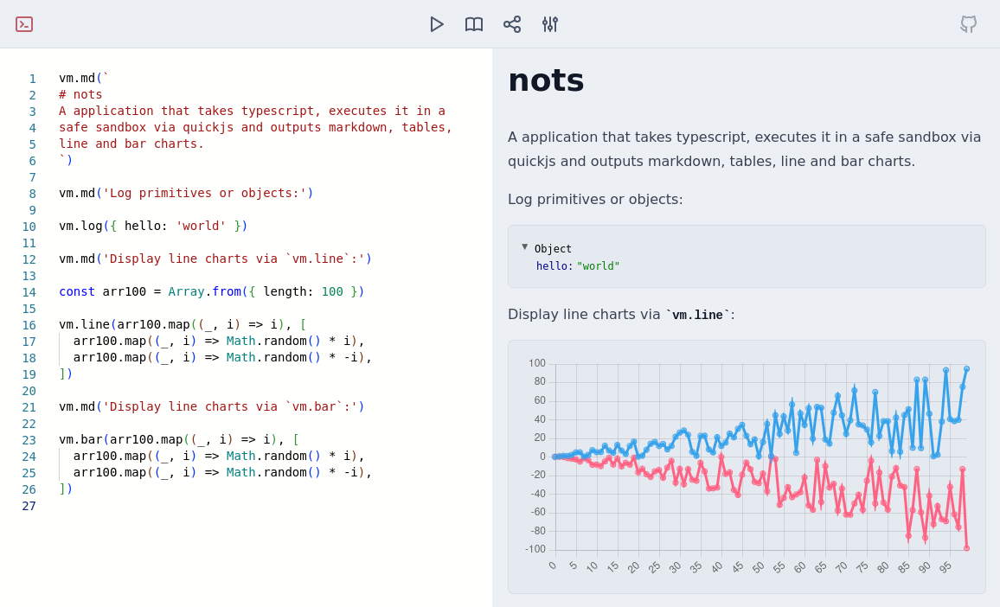

# nots

A application that takes typescript, executes it in a safe sandbox via quickjs and outputs markdown, tables, line and bar charts. 

Visit at [janstuemmel.de/jsrepl](https://janstuemmel.de/jsrepl/)

## Features

* Write code in monaco-editor
* Executes your code in a quickjs sandbox
* Configure memory and execution timout 
* Log primitives and objects via `vm.log`
* Render markdown via `vm.md`
* Display bar charts via `vm.bar`
* Display line charts via `vm.line`
* Display tables via `vm.table`
* Share gists via url fragment

## Disclaimer

This project was created within a weekend, thus it's very hacky 
and does not include tests. Use at your own risk!

## Screenshots

<picture>
  <source media="(prefers-color-scheme: dark)" srcset="./docs/screen-dark.png">
  
</picture>

## Built with

* [QickJS](https://bellard.org/quickjs/)
* [quickjs-emscripten](https://github.com/justjake/quickjs-emscripten)
* [monaco-editor](https://microsoft.github.io/monaco-editor/)
* [svelte](https://svelte.dev/)
* [vite](https://vitejs.dev/)
* [chart.js](https://www.chartjs.org/)
* [AG-Grid](https://www.ag-grid.com/)

## License

MIT
